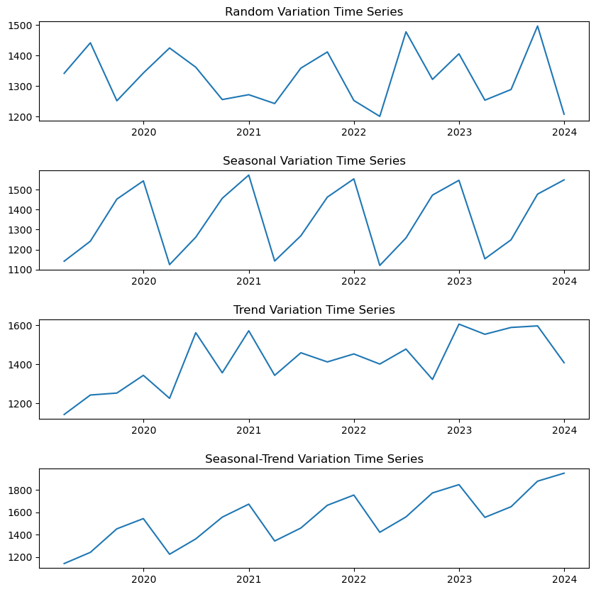

### 시계열 데이터

-   시간이 지남에 따라 기록된 정보들을 의미하고, 관측시간에 대한 관측자료의 관계로 표현한다.
-   시간 흐름에 따라 변화하는 방향성을 이해하고, 그 변화를 예측하는 것이 주 목적이다.
-   여름 휴가 기간 동안 특정 해변 도시의 방문자 수를 기록하고 분석하면, 일정한 패턴이나 추세를 찾게 된다.  
    이를 통해 다음 해의 방문자 수를 예측하여 관광 산업이나 여행 업계에서 효율적인 운영 및 마케팅 전략을 계획할 수 있다.
-   시계열 데이터의 유형에는 우연변동 시계열, 계절 변동 시계열, 추세 변동 시계열, 계절-추세 변동 시계열 데이터가 있다.
-   자료의 인덱스가 시간인 데이터이다.

#### 우연변동 시계열 데이터

-   특정한 패턴이나 추세 없이 우연한 요소에 의해 변하는 데이터이다.
-   패턴이나 규칙이 없고 우연히 발생하는 것처럼 보인다.

#### 계절변동 시계열 데이터

-   특정한 시간 주기(예: 일년)에 따라 발생하는 패턴이 나타나는 데이터이다.
-   특정 시간에 특정한 일이 반복된다.

#### 추세변동 시계열 데이터

-   시간에 따라 일정한 방향으로 계속해서 증가하거나 감소하는 추세를 보이는 데이터이다.
-   일정한 방향으로 계속해서 증가하거나 감소한다.

#### 계절-추세변동 시계열 데이터

-   추세와 계절성 요인이 함계 나타나는 데이터로서, 시간에 따라 일정한 추세가 있고 특정 시간 주기에 따른 패턴이 있는 데이터이다.
-   시간이 지남에 따라 일정한 방향으로 움직이면서도 특정 시간에 특정한 일이 반복된다.

### 정상성 (定常性, Stationarity)

-   일정해서 늘 한결같은 성질을 뜻한다.
-   관측된 시간에 무관하게 과거, 현재, 미래의 분포가 같아야 한다.
-   평균, 분산 등이 변하지 않으며 추세나 계절성이 없는 시계열 데이터이다.
-   하지만, 정상성을 나타내는 시계열은 장기적으로 볼 때 예측할 수 있는 패턴을 나타내지 않아야 한다. 즉, 불규칙해야한다.
-   즉, 어떤 특정한 주기로 반복하는 계절성이나 위로, 아래로 가는 추세성이 없어야 한다.

-   위 그래프들 중 정상성을 띠는 그래프는 (b), (g)이며,  
    (a), (c), (e), (f)는 추세변동, (d), (h)는 계절변동, (h), (i)는 계절-추세변동 시계열 데이터이다.
