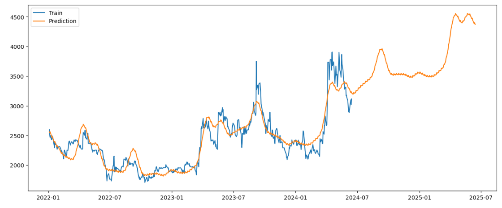

### 💰시계열 데이터 프로젝트: HB 테크놀러지 주가 분석 및 예측

-   HB테크놀러지(코스닥, 078150.KQ)의 주가와 금 ETF(GLD) 비교

#### 1. HB테크놀러지와 금ETF 시각화 및 비교

-   HB 테크놀러지의 경우, 2017년 LCD 업황 호조에 따라 주가가 약 6,000원대로 고점을 기록한 바 있으나, 이후 차츰 하락하는 추세를 보였습니다.

-   각 시계열 데이터에 차분을 진행하여 시각화합니다.

-   차분을 진행하여 시각화한 결과, HB 테크놀러지의 변동폭이 2021년과 2024년 초를 제외하면 크게 나타나지는 않았습니다.

-   하지만 금 ETF와 비교해보았을 때 HB테크놀러지의 주가는 변화율이 상대적으로 2배 이상 크게 나타났습니다.

-   수익률을 시각화해보았을 때, HB테크놀러지의 수익률 변동성이 금 ETF의 수익률 변동성보다 크게 나타났습니다.

-   연율화를 진행하여 수익을 비교해본 결과, HB 테크놀러지의 수익률은 금ETF의 수익률과 비슷한 수치를 보였습니다.

-   vif를 통해 다중공선성을 확인해보았지만 HB테크놀러지의 주가와 금 ETF의 주가 사이의 다중공선성 문제는 발생하지 않았습니다.

-   `rate_f_df`는 `f_df`에서의 수익률을 구한 뒤 `np.log()`를 통해 로그로 변환한 결과입니다.
-   두 데이터프레임에서의 각 컬럼별 분포를 확인한 결과는 아래와 같습니다.

-   일간 수익률입니다.

-   월간 수익률입니다.

#### 2. HB테크놀러지 주가에 대한 심층 분석

-   이동평균(window=20)으로 최솟값, 평균값, 중앙값 및 최댓값을 구합니다.

-   이동평균으로 구한 통계값 및 실제 주가의 움직임을 시각화합니다.

-   1달 영업일을 21일, 1년 영업일을 252로 가정하여 HB테크놀러지의 주가를 기술 분석하고, 골든 크로스와 데드 크로스를 파악합니다.

        h_df['SMA1'] = h_df['HBTechnology'].rolling(window=21).mean() #short-term
        h_df['SMA2'] = h_df['HBTechnology'].rolling(window=252).mean() #long-term
        h_df[['HBTechnology', 'SMA1', 'SMA2']].tail()

#### 3. ACF, PACF 확인 및 ARIMA 모델을 통한 머신러닝 학습

-   원본 주가의 ACF와 차분을 진행한 데이터의 PACF를 시각화해봅니다.

-   HB테크놀러지의 주가 데이터로부터 ACF를 시각화하였을 때, 시차가 증가함에 따라 점차 감소하기 때문에 추세를 가진 비정상 시계열로 볼 수 있습니다.
-   따라서 차분을 진행하여 PACF를 시각화하였으며, 표준정규분포 영역 내에 들어가는 첫 번째 지점인 절단점의 값이 1이므로,  
    AR모델의 차수는 0으로 설정하는 것이 바람직하다고 판단됩니다.

-   2022년 1월 1일을 기준으로 이후의 주가 데이터를 기준으로 ARIMA 모델을 학습하기 위해 데이터프레임을 슬라이싱합니다.

-   학습 데이터와 테스트 데이터를 분리합니다.(비율: 8:2)

-   최적의 차분 횟수를 구합니다.

-   확인 결과 최적의 차분 횟수는 1이었습니다.

-   ARIMA 모델로 학습을 진행했을 때, Best model은  
    AR차수(p)는 0, 차분 횟수(d)는 1, 이동평균의 크기(q)는 1일 때의 모델이었습니다.

-   융-박스 검정 통계량은 1.00으로, 해당 모델에서 잔차는 서로 독립이고 동일한 분포를 따른다고 볼 수 있습니다.
-   이분산성 검정 통계량의 경우 0.00으로, 잔차의 분산이 일정하지 않고 이분산성을 띤다고 판단됩니다.
-   자크-베라 검정 통계량도 마찬가지로 0.00으로, 잔차가 일정한 평균이나 분산을 따르지 않는 것으로 보입니다.
-   Skew(왜도)의 경우 2.86으로 어느 정도의 왜도가 나타나며, Kurtosis(첨도)의 경우에도 35.55로 매우 높은 첨도가 나타났습니다.

-   실제로 그래프 상에서도 첨도가 꽤 높게 나타났음을 알 수 있습니다.
-   또한 Correlogram을 보았을 때 약간의 물결 형태를 띰으로써 우연 변동 시계열임에도 불구하고 조금의 계절성이 나타났습니다.

-   실제 테스트 데이터와 모델의 예측값을 담은 `p_list`를 하나의 데이터프레임으로 묶어줍니다.

-   모델의 예측값과 실제 정답을 시각화하여 비교합니다.

-   `MAPE()` 함수를 정의하여 오차의 백분율 값을 구합니다.

#### 4. `Prophet()`을 사용한 주가 예측(딥러닝)

-   `Prophet()`에 전달하기 위해 컬럼의 이름을 형식에 맞게 바꿔줍니다.

-   `Prophet()` 모델로 학습을 진행합니다.
-   `make_future_dataframe()`을 통해 미래의 주가를 예측합니다.

-   실제 HBTechnology의 주가와, 모델이 예측한 미래의 주가를 합쳐 시각화합니다.

-   모델이 예측한 바에 따르면, HBTechnology의 주가는 현재 반등세를 이어나가며 상승했다가,  
    잠시 감소하여 머무른 뒤 새로운 고점을 돌파할 것으로 예상됩니다.
-   모델이 예측한 값의 신뢰구간은 아래와 같습니다.

-   모델이 예측한 값의 전체 추세와, 주간 계절성(Weekly seasonality), 연간 계절성(Yearly seasonality)은 아래와 같습니다.

-   모델이 예측한 바에 따르면, 앞으로 상승하는 추세를 보일 것이며,  
    요일별 계절성의 경우 시장이 열리지 않는 주말을 제외한 평일 영업일에는 모두 비슷한 수치를 보이며 뚜렷한 계절성을 나타내지 않았습니다.
-   반면 연간 계절성의 경우 4월과 9월에 특히 높은 수치를 보이는 양상을 띠었는데, 이는 아래와 같이 설명할 수 있습니다.
-   HB테크놀러지는 디스플레이/반도체 관련 기업으로, 디스플레이 관련 산업이 활기를 띨 때 주로 주가가 상승합니다.
-   특히 2월에 삼성의 신제품 발표가 있고 3월에 애플의 봄 이벤트가 있을 수 있기 때문에,  
    이 발표들이 디스플레이 관련 주가에 긍정적인 영향을 미치고, 그 효과가 4월까지 이어질 수 있다고 판단됩니다.
-   또한 애플의 주요 신제품 발표가 9월에 있기 때문에,  
    새로운 iPhone 출시와 관련된 기대감과 발표 후의 시장 반응이 디스플레이 관련 주가에 긍정적인 영향을 줄 수 있습니다.

-   다음은 다양한 하이퍼파라미터 조합으로 `Prophet()` 모델을 정의하여 훈련하였습니다.
-   20일 단위의 교차검증 결과, `mape`가 가장 낮았을 때의 파라미터는  
    `changepoint_prior_scale=0.05, seasonality_prior_scale=0.05, seasonality_mode='additive'`일 때였습니다.
-   따라서 해당 파라미터로 `Prophet()` 모델을 생성하여 학습 및 예측을 수행해봅니다.

-   `Prophet()` 모델의 파라미터를 조정하였을 때 전체적인 증가 추세는 이전과 유사하였으나, 변동폭이 매우 줄어들었습니다.
-   모델이 예측한 값의 신뢰구간은 아래와 같습니다.

-   모델이 예측한 값의 전체 추세와, 주간 계절성(Weekly seasonality), 연간 계절성(Yearly seasonality)은 아래와 같습니다.

-   연간 계절성에서는 여전히 4월과 9월에 높은 수치를 보이는 계절성을 보였으나,  
    주간 계절성에서는 특히 목요일과 금요일에 매우 높은 수치를 보였습니다.
-   이는 아래와 같은 방식으로 설명할 수 있습니다.

**1. 주간 투자자 행동 패턴**

-   투자자들이 주말을 앞두고 포지션을 조정하는 경향이 있을 수 있습니다.
-   주말 동안 발생할 수 있는 불확실성을 피하기 위해 일부 투자자들은 주식을 매도하거나 매수하는 활동을 목요일과 금요일에 집중할 수 있습니다.

**2. 기업 공시 및 뉴스 발표**

-   기업들이 주로 주중 후반에 공시나 뉴스 발표를 하는 경향이 있을 수 있습니다.
-   이러한 발표가 주가에 긍정적인 영향을 미친다면, 목요일과 금요일에 주가가 상승하는 패턴을 보일 수 있습니다.

**3. 주간 거래량 변화**

-   주 후반에 거래량이 증가하는 경향이 있다면, 거래량이 주가를 상승시키는 요인으로 작용할 수 있습니다.
-   많은 투자자들이 목요일과 금요일에 활발하게 거래할 경우 주가에 영향을 미칠 수 있습니다.

**4. 시장 심리 및 기대감**

-   주말을 앞두고 긍정적인 시장 심리가 형성될 수 있습니다.
-   예를 들어, 주말 동안 긍정적인 뉴스가 나올 것을 기대하는 투자자들이 목요일과 금요일에 주식을 매수하는 경향이 있을 수 있습니다.
